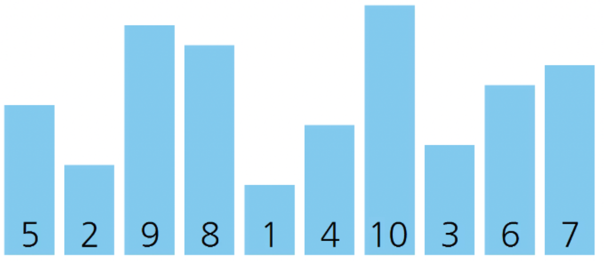

# Insertion_sort_visualization
삽입 정렬(Insertion sort) 알고리즘 시각화

## 0. 그대로 실행 시 주의사항
그대로 실행 시, 하위 디렉토리 ```\frames``` 를 생성하고 학습 내용에 대해 모두 저장하도록 되어 있습니다.
수많은 파일을 생성하고 싶지 않다면, ```Sort_visualization.cs``` 에서 ```Sort_visual```클래스의  ```save_frame()``` 함수를 수정하세요.

## 1. 삽입 정렬(Insertion sort)
**삽입 정렬**

 삽입 정렬(Insertion sort)은 간단한 정렬 알고리즘 중 하나로, 배열의 두 번째 원소 부터 차례로 선택하며 정렬된 부분과 비교하여 적절한 위치를 찾아 삽입해 정렬하는 알고리즘

**시간 복잡도**

최선의 경우 : 


최악의 경우 : 


**의사코드**


## 2. 시각화 방법
**배열 원소 상황 시각화**


**배열 원소 수치 시각화**


